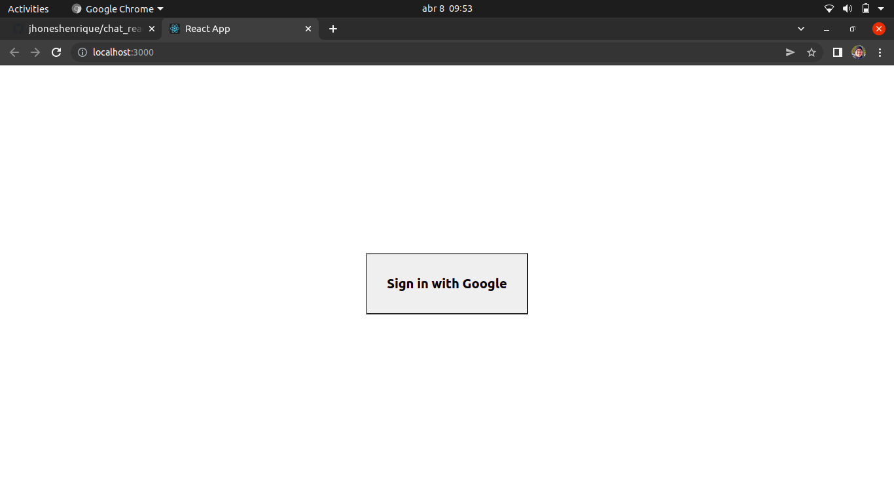
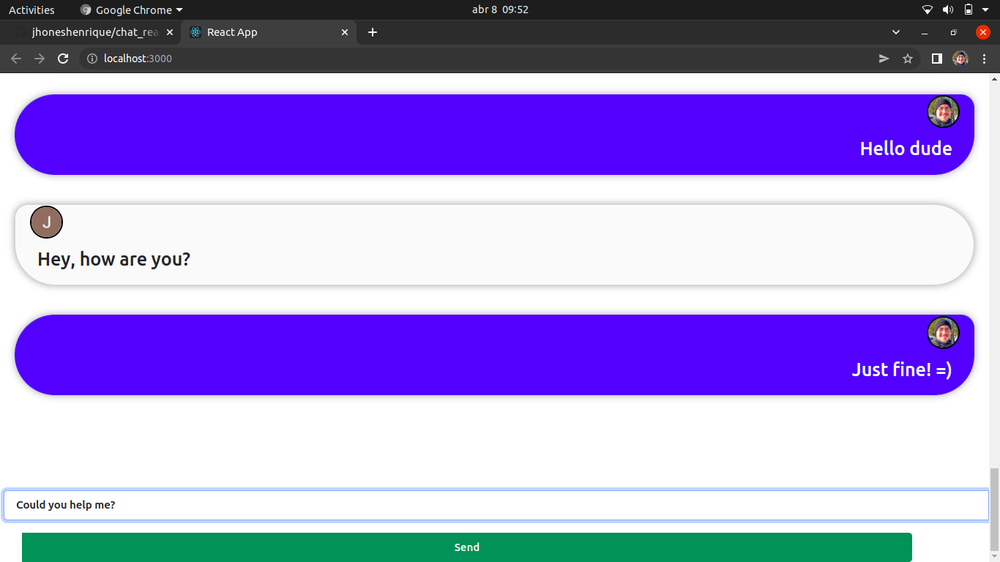

# Chat with React + Firebase

> This is a centralized Chat where users can log in using their Google accounts and talk to other people connected at the moment. The system was implemented using React to create the front-end and Firestore products like: Firestore and Authentication. 

# Technologies
 - React
 - Boostrap
 - Firestore
 - Firebase Authentication

# Images of the project:

